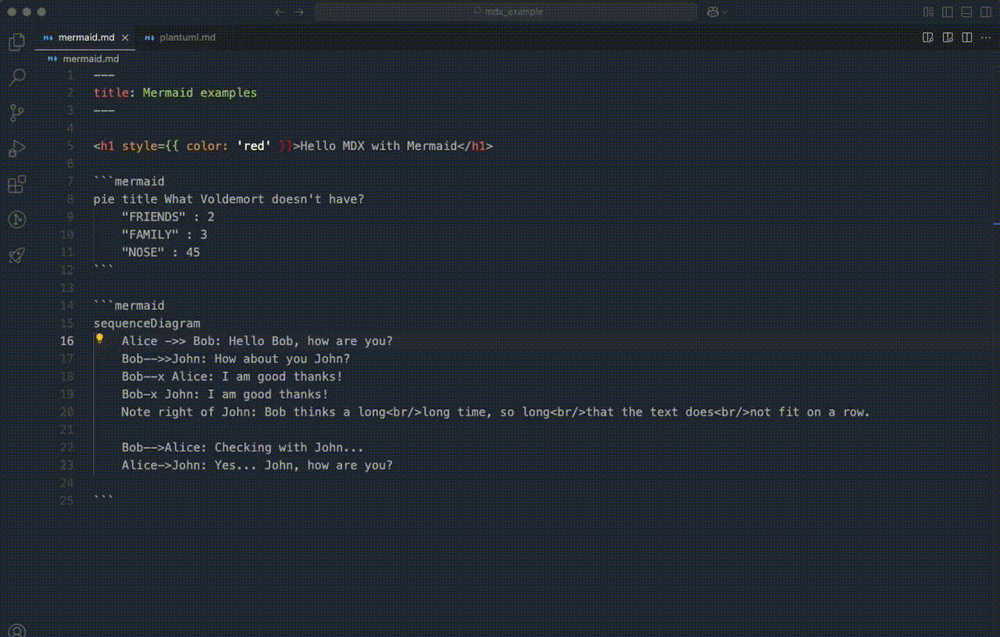

# Docusaurus MDX Previewer

A VSCode extension to preview Docusaurus MDX files with real-time rendering, including support for PlantUML and Mermaid diagrams.



## Features

- **Live Preview**: Preview your Docusaurus MDX files in a single, reusable Webview panel.
- **Diagram Support**: Render PlantUML and Mermaid diagrams using an external server (default: `https://kroki.io`).
- **Docusaurus Styling**: Applies Docusaurus's light theme for consistent styling.
- **Real-time Updates**: Automatically updates the preview when switching between MDX files or editing content.
- **Code Highlighting**: Syntax highlighting for code blocks using `rehype-highlight`.

## Installation

1. **Install from VSIX**:
   - Download the `.vsix` file from the release section or shared source.
   - In VSCode, go to Extensions view (`Ctrl+Shift+X` or `Cmd+Shift+X` on Mac), click the `...` menu, and select "Install from VSIX".
   - Choose the downloaded `.vsix` file.

2. **Install from Marketplace**:
   - Search for "Docusaurus MDX Previewer" in the VSCode Marketplace and click "Install".

## Usage

1. Open an MDX or Markdown file in VSCode.
2. Run the command `Show Docusaurus MDX Preview`:
   - Press `ctrl+alt+p` (or `cmd+alt+p` on Mac) to open the Command Palette.
   - Type and select `Show Docusaurus MDX Preview`.
3. The preview will appear in a panel beside your editor, updating automatically as you edit or switch files.

## Configuration

You can customize the diagram rendering server in VSCode settings:
- Open Settings (`Ctrl+,` or `Cmd+,`).
- Search for `docusaurusMdxPreview.plantumlServer`.
- Set a custom URL (default is `https://kroki.io`).

Example:
```json
{
  "docusaurusMdxPreview.plantumlServer": "https://your-custom-server.com"
}
